# 🌱 Website bán thực phẩm trực tuyến

**Nghĩa Thành Food** là website bán thực phẩm trực tuyến được xây dựng cho **Công ty TNHH Chế biến thực phẩm xuất khẩu Nghĩa Thành**.

Website gồm 2 khu vực chính:

- 👤 **Giao diện khách hàng:** đăng ký, đăng nhập, xem sản phẩm, giỏ hàng, thanh toán, theo dõi đơn hàng, tin tức và liên hệ.
- ⚙️ **Trang quản trị:** quản lý sản phẩm, danh mục, đơn hàng, khuyến mãi, người dùng, tin tức, liên hệ và báo cáo thống kê.

---

## 👨‍💻 Người thực hiện

- **Trần Văn Đạt**

---

## 📌 Mục tiêu của dự án

- Xây dựng website bán thực phẩm trực tuyến cho doanh nghiệp.
- Hỗ trợ khách hàng dễ dàng tìm kiếm và lựa chọn sản phẩm.
- Quản lý giỏ hàng và đặt hàng trực tuyến.
- Hỗ trợ quản trị viên quản lý hoạt động kinh doanh trên website.
- Quản lý đơn hàng, sản phẩm, khách hàng, khuyến mãi và nội dung website.
- Cung cấp báo cáo, thống kê phục vụ quản lý.

---

## 📌 Tính năng chính

### 👤 Chức năng dành cho khách hàng

#### 🏠 Trang chủ

Hiển thị thông tin giới thiệu, sản phẩm và các nội dung nổi bật của website.

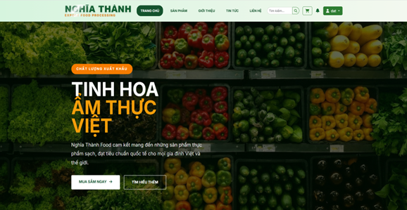

---

#### 📝 Đăng ký & Đăng nhập

Khách hàng có thể tạo tài khoản và đăng nhập để sử dụng các chức năng mua hàng.

| Đăng ký | Đăng nhập |
|:-------:|:---------:|
| 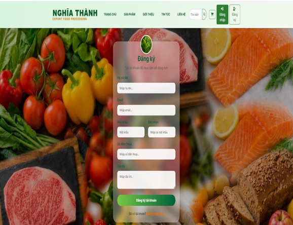 | 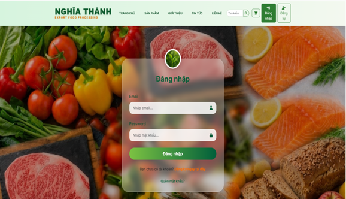 |

---

#### 🛒 Xem sản phẩm

Hiển thị danh sách thực phẩm, giúp khách hàng dễ dàng lựa chọn sản phẩm cần mua.

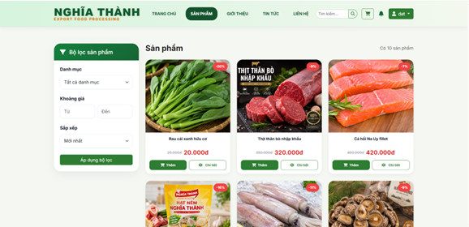

---

#### 🔎 Chi tiết sản phẩm

Hiển thị thông tin chi tiết của sản phẩm trước khi khách hàng thêm vào giỏ hàng.

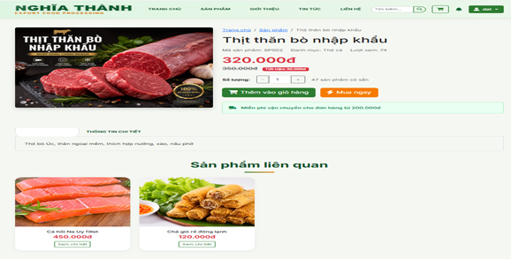

---

#### 🛍️ Giỏ hàng

Khách hàng có thể xem sản phẩm đã chọn, thay đổi số lượng và kiểm tra tổng tiền.

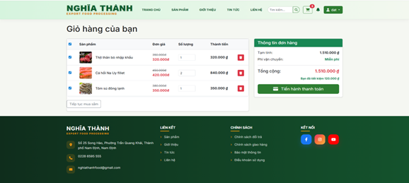

---

#### 💳 Thanh toán

Khách hàng kiểm tra thông tin đơn hàng, thông tin nhận hàng và thực hiện đặt hàng.

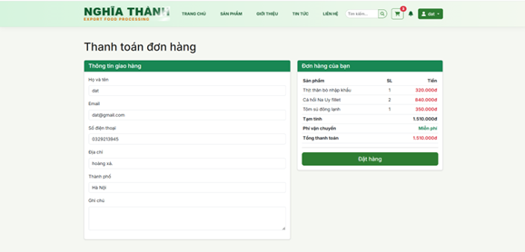

---

#### 📦 Theo dõi đơn hàng

Khách hàng có thể xem danh sách đơn hàng và theo dõi trạng thái xử lý đơn hàng.

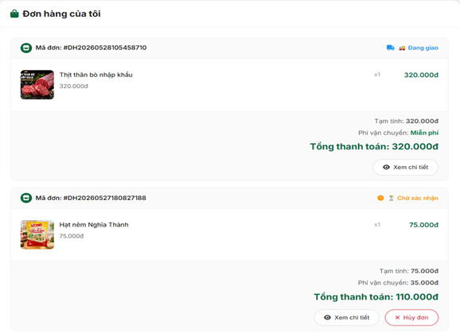

---

#### 🔔 Thông báo

Hiển thị các thông báo liên quan đến tài khoản và hoạt động mua hàng.

| Thông báo | Thông báo đơn hàng |
|:---------:|:------------------:|
| 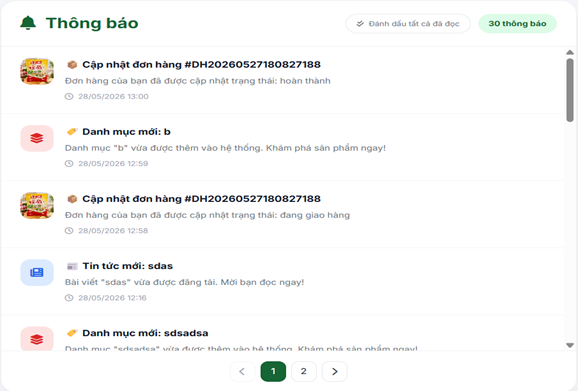 | 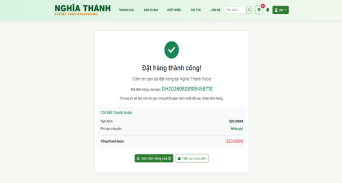 |

---

#### 📰 Tin tức

Khách hàng có thể xem các bài viết và thông tin được đăng tải trên website.

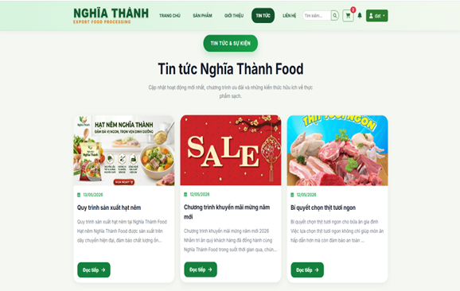

---

#### 📩 Liên hệ

Khách hàng có thể gửi nội dung liên hệ, phản hồi hoặc yêu cầu đến doanh nghiệp.

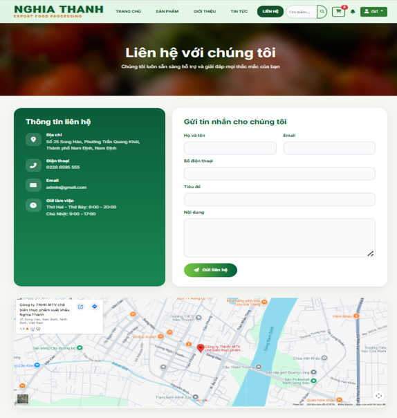

---

### ⚙️ Chức năng dành cho quản trị viên

#### 🔐 Đăng nhập Admin

Quản trị viên đăng nhập vào hệ thống quản trị bằng tài khoản có quyền quản trị.

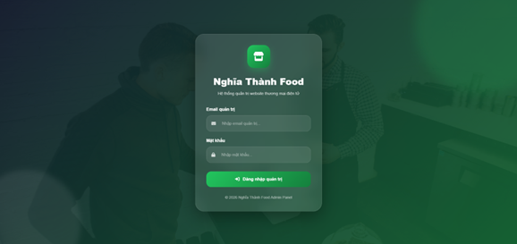

---

#### 📊 Dashboard

Tổng quan tình hình hoạt động của website và các số liệu quản lý.

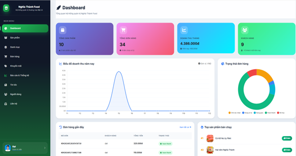

---

#### 📦 Quản lý sản phẩm

Quản trị viên có thể thêm, sửa, xóa và quản lý thông tin các sản phẩm thực phẩm.

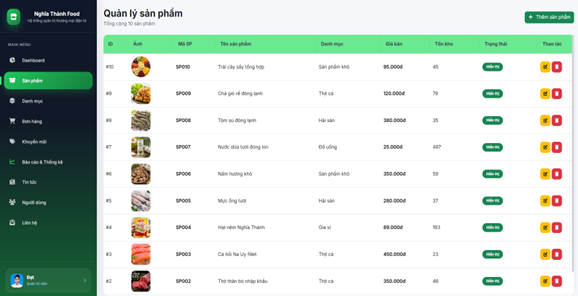

---

#### 🗂️ Quản lý danh mục

Quản lý các danh mục sản phẩm được sử dụng trên website.

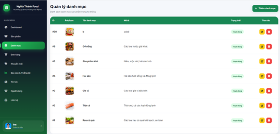

---

#### 🧾 Quản lý đơn hàng

Theo dõi và cập nhật trạng thái các đơn hàng của khách hàng.

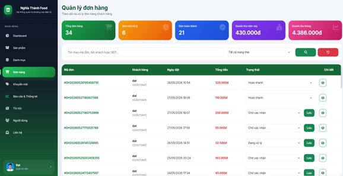

---

#### 🎁 Quản lý khuyến mãi

Quản lý mã khuyến mãi và các chương trình hỗ trợ giảm giá cho khách hàng.

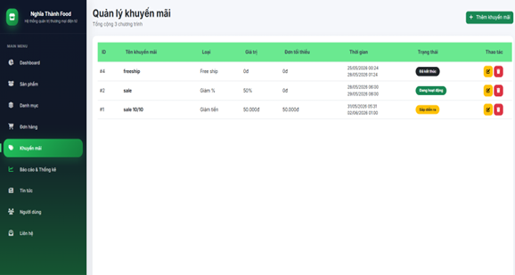

---

#### 👥 Quản lý người dùng

Quản lý tài khoản khách hàng và thông tin người dùng trên hệ thống.

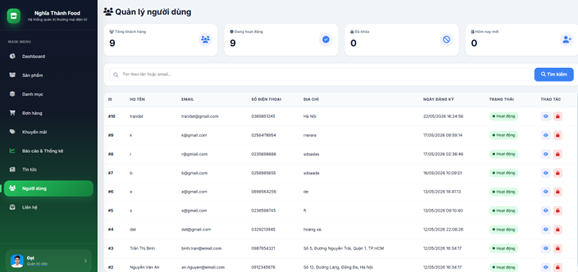

---

#### 📰 Quản lý tin tức

Quản trị viên có thể quản lý các bài viết và nội dung tin tức trên website.

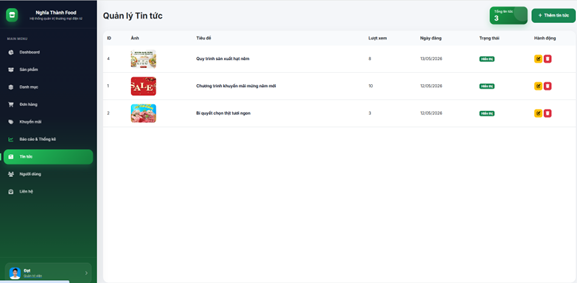

---

#### 📩 Quản lý liên hệ

Quản lý các nội dung liên hệ do khách hàng gửi và xử lý phản hồi.

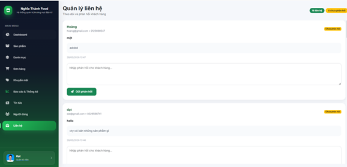

---

#### 📈 Báo cáo & Thống kê

Hỗ trợ quản trị viên theo dõi các số liệu phục vụ việc quản lý và đánh giá hoạt động kinh doanh.

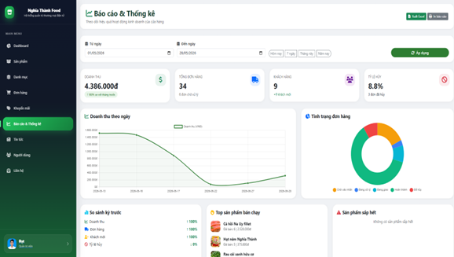

---

## 🛠️ Công nghệ sử dụng

- **PHP 8.2**
- **HTML5**
- **CSS3**
- **JavaScript**
- **Bootstrap 5.3**
- **Font Awesome**
- **SQLite**
- **PHPMailer**
- **Composer**
- **XAMPP**
- **Visual Studio Code**
- **Git & GitHub**

---

## 📁 Cấu trúc thư mục

```text
Website_banthucpham/
│
├── admin/
│   ├── auth/
│   ├── categories/
│   ├── contact/
│   ├── news/
│   └── orders/
│
├── public/
│   ├── login.php
│   ├── register.php
│   ├── cart.php
│   ├── checkout.php
│   └── ...
│
├── database/
│   └── database.db
│
├── img/
│   ├── Trang_chu.png
│   ├── Dang_ky.png
│   ├── Dang_nhap.png
│   ├── San_pham.png
│   └── ...
│
├── vendor/
│
├── composer.json
├── composer.lock
└── README.md
```

---

## 🛠️ Hướng dẫn cài đặt

### 📌 1. Cài đặt XAMPP

Cài đặt **XAMPP** và bật PHP để chạy website trên máy tính.

---

### 📌 2. Cài đặt Composer

Cài đặt Composer để quản lý các thư viện PHP được sử dụng trong dự án.

Sau khi cài đặt, mở Terminal tại thư mục dự án và chạy:

```bash
composer install
```

---

### 📌 3. Đặt mã nguồn

Đưa thư mục dự án vào vị trí phù hợp trên máy tính.

Ví dụ:

```text
D:\Website_banthucpham
```

---

### 📌 4. Kiểm tra cơ sở dữ liệu

Cơ sở dữ liệu của hệ thống được lưu tại:

```text
database/database.db
```

---

### 📌 5. Chạy website

Mở Terminal tại thư mục dự án và chạy:

```bash
php -S localhost:8000
```

Sau đó truy cập:

```text
http://localhost:8000
```

---

## 🛒 Quy trình mua hàng

```text
Trang chủ
    ↓
Xem sản phẩm
    ↓
Chi tiết sản phẩm
    ↓
Thêm vào giỏ hàng
    ↓
Giỏ hàng
    ↓
Thanh toán
    ↓
Đặt hàng
    ↓
Theo dõi đơn hàng
```

---

## 📦 Trạng thái đơn hàng

Đơn hàng được quản lý theo các trạng thái:

- `cho_xac_nhan` – Chờ xác nhận
- `dang_xu_ly` – Đang xử lý
- `dang_giao` – Đang giao
- `hoan_thanh` – Hoàn thành
- `da_huy` – Đã hủy

---

## 🚚 Chính sách phí giao hàng

- Đơn hàng có giá trị dưới **200.000 VNĐ**: phí giao hàng **25.000 VNĐ**.
- Đơn hàng từ **200.000 VNĐ trở lên**: miễn phí giao hàng.
- Các chương trình khuyến mãi miễn phí giao hàng có thể áp dụng theo từng chương trình.

---

## 👥 Phân quyền hệ thống

| Vai trò | Quyền hạn |
|:-------:|-----------|
| 👤 Khách hàng | Đăng ký, đăng nhập, xem sản phẩm, quản lý giỏ hàng, đặt hàng, theo dõi đơn hàng, xem tin tức và gửi liên hệ |
| 👑 Quản trị viên | Quản lý sản phẩm, danh mục, đơn hàng, khuyến mãi, người dùng, tin tức, liên hệ và báo cáo thống kê |

---

## 📧 Gửi email

Hệ thống sử dụng **PHPMailer** để hỗ trợ các chức năng gửi email, phục vụ quá trình xác thực và các nghiệp vụ liên quan đến tài khoản người dùng.

---

## 🔐 Bảo mật tài khoản

Hệ thống hỗ trợ các nghiệp vụ:

- Đăng ký tài khoản.
- Đăng nhập.
- Xác thực OTP.
- Quên mật khẩu.
- Đổi email.
- Phân quyền tài khoản.
- Quản lý phiên đăng nhập.

---

## 🚀 Định hướng phát triển

Trong tương lai có thể mở rộng:

- Tích hợp thanh toán trực tuyến.
- Tích hợp đơn vị vận chuyển.
- Bổ sung tìm kiếm và lọc sản phẩm nâng cao.
- Xây dựng API cho ứng dụng di động.
- Cải thiện báo cáo và thống kê.
- Tối ưu giao diện trên thiết bị di động.
- Bổ sung thêm các chương trình chăm sóc khách hàng.

---

## 📌 Thông tin dự án

**Tên dự án:** Nghĩa Thành Food  
**Đề tài:** Thiết kế website bán thực phẩm cho công ty bằng ngôn ngữ PHP, HTML  
**Đơn vị:** Công ty TNHH Chế biến thực phẩm xuất khẩu Nghĩa Thành  
**Người thực hiện:** Trần Văn Đạt  
**Ngôn ngữ chính:** PHP  
**Cơ sở dữ liệu:** SQLite  

---

## ⭐ Nghĩa Thành Food

Website được xây dựng nhằm hỗ trợ doanh nghiệp quản lý hoạt động bán thực phẩm trực tuyến và mang đến trải nghiệm mua hàng thuận tiện cho khách hàng.
